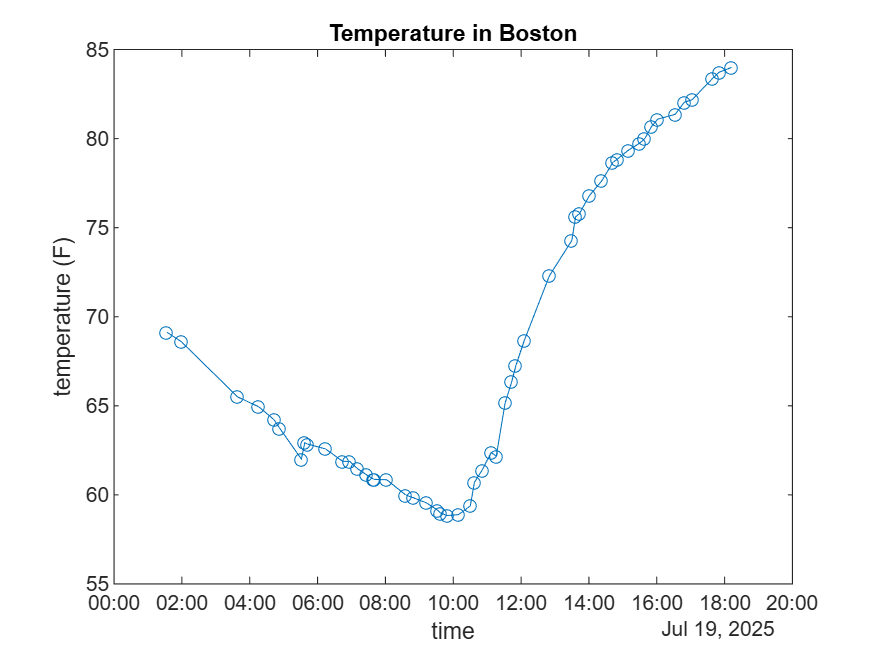
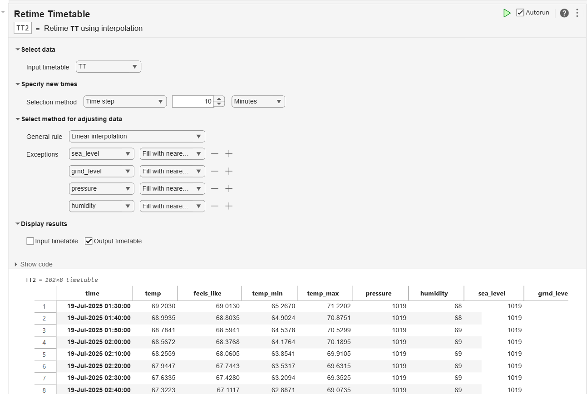
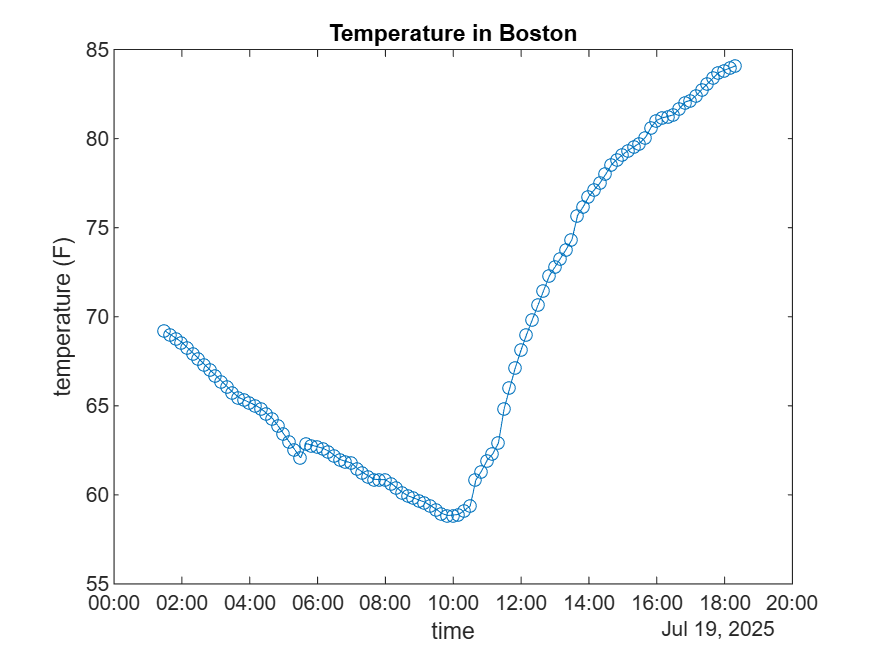

# Weather actions

GitHub Action to scrape the weather️


<a name="beginToc"></a>

## Table of Contents
&emsp;&emsp;[Intro](#intro)
 
&emsp;&emsp;[Setup](#setup)
 
&emsp;&emsp;[PyGitHub](#pygithub)
 
&emsp;&emsp;[Artifacts](#artifacts)
 
&emsp;&emsp;[Retime](#retime)
 
<a name="endToc"></a>

## Intro

GitHub Actions enable to trigger workflows on schedule.


This is the syntax used in order to scrape the weather.

```
┌───────────── minute (*/10 → every 10 minutes)
│ ┌─────────── hour   (*   → every hour)
│ │ ┌───────── day     (*   → every day of month)
│ │ │ ┌─────── month   (*   → every month)
│ │ │ │ ┌───── weekday (*   → every day of week)
│ │ │ │ │
*/10 * * * *
```

But the precision of the scheduler isn't great, so retiming will be necessary in post\-processing.


This script will retrieve Artifacts from GitHub Actions that scraped openweathermap.

## Setup

This setup step is specific to MATLAB Online, retrieving 

```matlab
if matlab.internal.environment.context.isMATLABOnline
    setup_python
end
```

Connect to Python in Out\-Of\-Process execution mode (to enable the termination of the environment without logging out of MATLAB Online)

```matlab
pe = pyenv(ExecutionMode="OutOfProcess")
```

```matlabTextOutput
pe = 
  PythonEnvironment with properties:

          Version: "3.10"
       Executable: "/usr/bin/python3"
          Library: "libpython3.10.so.1.0"
             Home: "/usr"
           Status: NotLoaded
    ExecutionMode: OutOfProcess

```

Create a GitHub [Personal Access Token](https://github.com/settings/personal-access-tokens/new) with permission to the repo actions (read only), and save it as a variable  `GITHUB_TOKEN` in  a file called `.env`

```matlab
loadenv(".env")
token = getenv("GITHUB_TOKEN");
```

## PyGitHub
```matlab
g = py.github.Github(token);
repo = g.get_repo("slevin48/weather-scraper")
```

```matlabTextOutput
repo = 
  Python Repository with properties:

                  allow_auto_merge: [1x1 py.NoneType]
                     allow_forking: 1
                allow_merge_commit: [1x1 py.NoneType]
                allow_rebase_merge: [1x1 py.NoneType]
                allow_squash_merge: [1x1 py.NoneType]
               allow_update_branch: [1x1 py.NoneType]
          anonymous_access_enabled: [1x1 py.NoneType]
                       archive_url: [1x76 py.str]
                          archived: 0
                     assignees_url: [1x70 py.str]
                         blobs_url: [1x69 py.str]
                      branches_url: [1x71 py.str]
                         clone_url: [1x47 py.str]
                   code_of_conduct: [1x1 py.NoneType]
                 collaborators_url: [1x82 py.str]
                      comments_url: [1x71 py.str]
                       commits_url: [1x67 py.str]
                       compare_url: [1x77 py.str]
                         completed: 1
                      contents_url: [1x70 py.str]
                  contributors_url: [1x66 py.str]
                        created_at: [1x1 py.datetime.datetime]
                 custom_properties: [1x1 py.NoneType]
                    default_branch: [1x4 py.str]
            delete_branch_on_merge: [1x1 py.NoneType]
                   deployments_url: [1x65 py.str]
                       description: [1x41 py.str]
                          disabled: 0
                     downloads_url: [1x63 py.str]
                              etag: [1x68 py.str]
                        events_url: [1x60 py.str]
                              fork: 0
                             forks: [1x1 py.int]
                       forks_count: [1x1 py.int]
                         forks_url: [1x59 py.str]
                         full_name: [1x24 py.str]
                   git_commits_url: [1x71 py.str]
                      git_refs_url: [1x68 py.str]
                      git_tags_url: [1x68 py.str]
                           git_url: [1x45 py.str]
                   has_discussions: 0
                     has_downloads: 1
                        has_issues: 1
                         has_pages: 0
                      has_projects: 1
                          has_wiki: 1
                          homepage: [1x0 py.str]
                         hooks_url: [1x59 py.str]
                          html_url: [1x43 py.str]
                                id: [1x1 py.int]
                       is_template: 0
                 issue_comment_url: [1x78 py.str]
                  issue_events_url: [1x76 py.str]
                        issues_url: [1x69 py.str]
                          keys_url: [1x67 py.str]
                        labels_url: [1x67 py.str]
                          language: [1x6 py.str]
                     languages_url: [1x63 py.str]
                     last_modified: [1x29 py.str]
            last_modified_datetime: [1x1 py.datetime.datetime]
                           license: [1x1 py.NoneType]
                     master_branch: [1x1 py.NoneType]
              merge_commit_message: [1x1 py.NoneType]
                merge_commit_title: [1x1 py.NoneType]
                        merges_url: [1x60 py.str]
                    milestones_url: [1x73 py.str]
                        mirror_url: [1x1 py.NoneType]
                              name: [1x15 py.str]
                     network_count: [1x1 py.int]
                           node_id: [1x12 py.str]
                 notifications_url: [1x93 py.str]
                       open_issues: [1x1 py.int]
                 open_issues_count: [1x1 py.int]
                      organization: [1x1 py.NoneType]
                             owner: [1x1 py.github.NamedUser.NamedUser]
                            parent: [1x1 py.NoneType]
                       permissions: [1x1 py.github.Permissions.Permissions]
                           private: 0
                         pulls_url: [1x68 py.str]
                         pushed_at: [1x1 py.datetime.datetime]
                          raw_data: [1x1 py.dict]
                       raw_headers: [1x1 py.dict]
                      releases_url: [1x67 py.str]
                         requester: [1x1 py.github.Requester.Requester]
                         role_name: [1x1 py.NoneType]
             security_and_analysis: [1x1 py.NoneType]
                              size: [1x1 py.int]
                            source: [1x1 py.NoneType]
       squash_merge_commit_message: [1x1 py.NoneType]
         squash_merge_commit_title: [1x1 py.NoneType]
                           ssh_url: [1x43 py.str]
                  stargazers_count: [1x1 py.int]
                    stargazers_url: [1x64 py.str]
                        starred_at: [1x1 py.NoneType]
                      statuses_url: [1x68 py.str]
                 subscribers_count: [1x1 py.int]
                   subscribers_url: [1x65 py.str]
                  subscription_url: [1x66 py.str]
                           svn_url: [1x43 py.str]
                          tags_url: [1x58 py.str]
                         teams_url: [1x59 py.str]
                  temp_clone_token: [1x1 py.NoneType]
               template_repository: [1x1 py.NoneType]
                            topics: [1x2 py.list]
                         trees_url: [1x69 py.str]
                        updated_at: [1x1 py.datetime.datetime]
                               url: [1x53 py.str]
    use_squash_pr_title_as_default: [1x1 py.NoneType]
                        visibility: [1x6 py.str]
                          watchers: [1x1 py.int]
                    watchers_count: [1x1 py.int]
       web_commit_signoff_required: 0

    Repository(full_name="slevin48/weather-scraper")

```

```matlab
% repo.get_contents("README.md").decoded_content.decode("utf-8")
```

Fetch successful workflow runs from the repository

```matlab
successful_runs = repo.get_workflow_runs(status="success")
```

```matlabTextOutput
successful_runs = 
  Python PaginatedList with properties:

    is_graphql: 0
       is_rest: 1
      reversed: [1x1 py.github.PaginatedList.PaginatedList]
    totalCount: [1x1 py.int]

    <github.PaginatedList.PaginatedList object at 0x71bae2149030>

```

Build a list of the names and IDs of the successful runs

```matlab
runs_list = pyrun("runs_list = [run.id for run in successful_runs]","runs_list",successful_runs=successful_runs)
```

```matlabTextOutput
runs_list = 
  Python list with values:

    [16391395647, 16391241500, 16391191471, 16390929116, 16390804032, 16390682584, 16390456143, 16390314706, 16390229454, 16390133881, 16389964859, 16389837244, 16389786553, 16389662839, 16389486972, 16389373560, 16389306222, 16389174569, 16388929436, 16388591956, 16388389249, 16388331245, 16388266679, 16388192423, 16388067912, 16387967805, 16387917262, 16387817958, 16387621136, 16387480892, 16387434103, 16387339682, 16387183632, 16387052613, 16386929475, 16386718842, 16386555986, 16386502359, 16386397034, 16386268977, 16386124980, 16386030270, 16385781572, 16385631558, 16385578983, 16385448348, 16385194196, 16385091436, 16384870251, 16384569967, 16383763637, 16383554036, 16383510363]

    Use string, double or cell function to convert to a MATLAB array.

```

## Artifacts

Python black magic one liner extend/list comprehension (ask ChatGPT)

```matlab
artifacts_info = pyrun('artifacts_info = [];artifacts_info.extend([{**{"run_id": run_id, "artifact_obj": a}, "artifact_id": a.id, "name": a.name, "size_in_bytes": a.size_in_bytes, "created_at": a.created_at, "expired": a.expired} for run_id in runs_list for a in repo.get_workflow_run(run_id).get_artifacts()])', 'artifacts_info', runs_list=runs_list, repo=repo)
```

```matlabTextOutput
artifacts_info = 
  Python list with values:

    [{'run_id': 16391395647, 'artifact_obj': Artifact(name="boston-weather", id=3570153600), 'artifact_id': 3570153600, 'name': 'boston-weather', 'size_in_bytes': 550, 'created_at': datetime.datetime(2025, 7, 19, 18, 12, 58, tzinfo=datetime.timezone.utc), 'expired': False}, {'run_id': 16391241500, 'artifact_obj': Artifact(name="boston-weather", id=3570118115), 'artifact_id': 3570118115, 'name': 'boston-weather', 'size_in_bytes': 546, 'created_at': datetime.datetime(2025, 7, 19, 17, 53, 4, tzinfo=datetime.timezone.utc), 'expired': False}, {'run_id': 16391191471, 'artifact_obj': Artifact(name="boston-weather", id=3570107235), 'artifact_id': 3570107235, 'name': 'boston-weather', 'size_in_bytes': 553, 'created_at': datetime.datetime(2025, 7, 19, 17, 46, 42, tzinfo=datetime.timezone.utc), 'expired': False}, {'run_id': 16390929116, 'artifact_obj': Artifact(name="boston-weather", id=3570044265), 'artifact_id': 3570044265, 'name': 'boston-weather', 'size_in_bytes': 552, 'created_at': datetime.datetime(2025, 7, 19, 17, 13, 4, tzinfo=datetime.timezone.utc), 'expired': False}, {'run_id': 16390804032, 'artifact_obj': Artifact(name="boston-weather", id=3570014288), 'artifact_id': 3570014288, 'name': 'boston-weather', 'size_in_bytes': 537, 'created_at': datetime.datetime(2025, 7, 19, 16, 57, 27, tzinfo=datetime.timezone.utc), 'expired': False}, {'run_id': 16390682584, 'artifact_obj': Artifact(name="boston-weather", id=3569983201), 'artifact_id': 3569983201, 'name': 'boston-weather', 'size_in_bytes': 539, 'created_at': datetime.datetime(2025, 7, 19, 16, 40, 41, tzinfo=datetime.timezone.utc), 'expired': False}, {'run_id': 16390456143, 'artifact_obj': Artifact(name="boston-weather", id=3569918720), 'artifact_id': 3569918720, 'name': 'boston-weather', 'size_in_bytes': 546, 'created_at': datetime.datetime(2025, 7, 19, 16, 11, 3, tzinfo=datetime.timezone.utc), 'expired': False}, {'run_id': 16390314706, 'artifact_obj': Artifact(name="boston-weather", id=3569882134), 'artifact_id': 3569882134, 'name': 'boston-weather', 'size_in_bytes': 544, 'created_at': datetime.datetime(2025, 7, 19, 15, 54, 20, tzinfo=datetime.timezone.utc), 'expired': False}, {'run_id': 16390229454, 'artifact_obj': Artifact(name="boston-weather", id=3569861454), 'artifact_id': 3569861454, 'name': 'boston-weather', 'size_in_bytes': 540, 'created_at': datetime.datetime(2025, 7, 19, 15, 42, 17, tzinfo=datetime.timezone.utc), 'expired': False}, {'run_id': 16390133881, 'artifact_obj': Artifact(name="boston-weather", id=3569839810), 'artifact_id': 3569839810, 'name': 'boston-weather', 'size_in_bytes': 541, 'created_at': datetime.datetime(2025, 7, 19, 15, 29, 56, tzinfo=datetime.timezone.utc), 'expired': False}, {'run_id': 16389964859, 'artifact_obj': Artifact(name="boston-weather", id=3569801275), 'artifact_id': 3569801275, 'name': 'boston-weather', 'size_in_bytes': 542, 'created_at': datetime.datetime(2025, 7, 19, 15, 9, 21, tzinfo=datetime.timezone.utc), 'expired': False}, {'run_id': 16389837244, 'artifact_obj': Artifact(name="boston-weather", id=3569770412), 'artifact_id': 3569770412, 'name': 'boston-weather', 'size_in_bytes': 541, 'created_at': datetime.datetime(2025, 7, 19, 14, 52, 59, tzinfo=datetime.timezone.utc), 'expired': False}, {'run_id': 16389786553, 'artifact_obj': Artifact(name="boston-weather", id=3569758498), 'artifact_id': 3569758498, 'name': 'boston-weather', 'size_in_bytes': 543, 'created_at': datetime.datetime(2025, 7, 19, 14, 46, 38, tzinfo=datetime.timezone.utc), 'expired': False}, {'run_id': 16389662839, 'artifact_obj': Artifact(name="boston-weather", id=3569730162), 'artifact_id': 3569730162, 'name': 'boston-weather', 'size_in_bytes': 547, 'created_at': datetime.datetime(2025, 7, 19, 14, 31, 12, tzinfo=datetime.timezone.utc), 'expired': False}, {'run_id': 16389486972, 'artifact_obj': Artifact(name="boston-weather", id=3569688695), 'artifact_id': 3569688695, 'name': 'boston-weather', 'size_in_bytes': 546, 'created_at': datetime.datetime(2025, 7, 19, 14, 9, 57, tzinfo=datetime.timezone.utc), 'expired': False}, {'run_id': 16389373560, 'artifact_obj': Artifact(name="boston-weather", id=3569659780), 'artifact_id': 3569659780, 'name': 'boston-weather', 'size_in_bytes': 546, 'created_at': datetime.datetime(2025, 7, 19, 13, 55, 56, tzinfo=datetime.timezone.utc), 'expired': False}, {'run_id': 16389306222, 'artifact_obj': Artifact(name="boston-weather", id=3569643202), 'artifact_id': 3569643202, 'name': 'boston-weather', 'size_in_bytes': 547, 'created_at': datetime.datetime(2025, 7, 19, 13, 46, 57, tzinfo=datetime.timezone.utc), 'expired': False}, {'run_id': 16389174569, 'artifact_obj': Artifact(name="boston-weather", id=3569611849), 'artifact_id': 3569611849, 'name': 'boston-weather', 'size_in_bytes': 539, 'created_at': datetime.datetime(2025, 7, 19, 13, 29, 45, tzinfo=datetime.timezone.utc), 'expired': False}, {'run_id': 16388929436, 'artifact_obj': Artifact(name="boston-weather", id=3569557613), 'artifact_id': 3569557613, 'name': 'boston-weather', 'size_in_bytes': 539, 'created_at': datetime.datetime(2025, 7, 19, 12, 59, 33, tzinfo=datetime.timezone.utc), 'expired': False}, {'run_id': 16388591956, 'artifact_obj': Artifact(name="boston-weather", id=3569480918), 'artifact_id': 3569480918, 'name': 'boston-weather', 'size_in_bytes': 546, 'created_at': datetime.datetime(2025, 7, 19, 12, 17, 23, tzinfo=datetime.timezone.utc), 'expired': False}, {'run_id': 16388389249, 'artifact_obj': Artifact(name="boston-weather", id=3569425716), 'artifact_id': 3569425716, 'name': 'boston-weather', 'size_in_bytes': 543, 'created_at': datetime.datetime(2025, 7, 19, 11, 51, 29, tzinfo=datetime.timezone.utc), 'expired': False}, {'run_id': 16388331245, 'artifact_obj': Artifact(name="boston-weather", id=3569411586), 'artifact_id': 3569411586, 'name': 'boston-weather', 'size_in_bytes': 544, 'created_at': datetime.datetime(2025, 7, 19, 11, 43, 31, tzinfo=datetime.timezone.utc), 'expired': False}, {'run_id': 16388266679, 'artifact_obj': Artifact(name="boston-weather", id=3569397504), 'artifact_id': 3569397504, 'name': 'boston-weather', 'size_in_bytes': 541, 'created_at': datetime.datetime(2025, 7, 19, 11, 34, 48, tzinfo=datetime.timezone.utc), 'expired': False}, {'run_id': 16388192423, 'artifact_obj': Artifact(name="boston-weather", id=3569381920), 'artifact_id': 3569381920, 'name': 'boston-weather', 'size_in_bytes': 551, 'created_at': datetime.datetime(2025, 7, 19, 11, 25, 20, tzinfo=datetime.timezone.utc), 'expired': False}, {'run_id': 16388067912, 'artifact_obj': Artifact(name="boston-weather", id=3569356392), 'artifact_id': 3569356392, 'name': 'boston-weather', 'size_in_bytes': 555, 'created_at': datetime.datetime(2025, 7, 19, 11, 9, 15, tzinfo=datetime.timezone.utc), 'expired': False}, {'run_id': 16387967805, 'artifact_obj': Artifact(name="boston-weather", id=3569332352), 'artifact_id': 3569332352, 'name': 'boston-weather', 'size_in_bytes': 543, 'created_at': datetime.datetime(2025, 7, 19, 10, 55, 45, tzinfo=datetime.timezone.utc), 'expired': False}, {'run_id': 16387917262, 'artifact_obj': Artifact(name="boston-weather", id=3569321342), 'artifact_id': 3569321342, 'name': 'boston-weather', 'size_in_bytes': 551, 'created_at': datetime.datetime(2025, 7, 19, 10, 49, 11, tzinfo=datetime.timezone.utc), 'expired': False}, {'run_id': 16387817958, 'artifact_obj': Artifact(name="boston-weather", id=3569296345), 'artifact_id': 3569296345, 'name': 'boston-weather', 'size_in_bytes': 552, 'created_at': datetime.datetime(2025, 7, 19, 10, 35, 38, tzinfo=datetime.timezone.utc), 'expired': False}, {'run_id': 16387621136, 'artifact_obj': Artifact(name="boston-weather", id=3569248785), 'artifact_id': 3569248785, 'name': 'boston-weather', 'size_in_bytes': 552, 'created_at': datetime.datetime(2025, 7, 19, 10, 10, 5, tzinfo=datetime.timezone.utc), 'expired': False}, {'run_id': 16387480892, 'artifact_obj': Artifact(name="boston-weather", id=3569216693), 'artifact_id': 3569216693, 'name': 'boston-weather', 'size_in_bytes': 554, 'created_at': datetime.datetime(2025, 7, 19, 9, 51, 35, tzinfo=datetime.timezone.utc), 'expired': False}, {'run_id': 16387434103, 'artifact_obj': Artifact(name="boston-weather", id=3569205793), 'artifact_id': 3569205793, 'name': 'boston-weather', 'size_in_bytes': 552, 'created_at': datetime.datetime(2025, 7, 19, 9, 45, 18, tzinfo=datetime.timezone.utc), 'expired': False}, {'run_id': 16387339682, 'artifact_obj': Artifact(name="boston-weather", id=3569184319), 'artifact_id': 3569184319, 'name': 'boston-weather', 'size_in_bytes': 555, 'created_at': datetime.datetime(2025, 7, 19, 9, 32, 32, tzinfo=datetime.timezone.utc), 'expired': False}, {'run_id': 16387183632, 'artifact_obj': Artifact(name="boston-weather", id=3569149666), 'artifact_id': 3569149666, 'name': 'boston-weather', 'size_in_bytes': 554, 'created_at': datetime.datetime(2025, 7, 19, 9, 12, 25, tzinfo=datetime.timezone.utc), 'expired': False}, {'run_id': 16387052613, 'artifact_obj': Artifact(name="boston-weather", id=3569116928), 'artifact_id': 3569116928, 'name': 'boston-weather', 'size_in_bytes': 551, 'created_at': datetime.datetime(2025, 7, 19, 8, 56, 22, tzinfo=datetime.timezone.utc), 'expired': False}, {'run_id': 16386929475, 'artifact_obj': Artifact(name="boston-weather", id=3569087235), 'artifact_id': 3569087235, 'name': 'boston-weather', 'size_in_bytes': 553, 'created_at': datetime.datetime(2025, 7, 19, 8, 40, 30, tzinfo=datetime.timezone.utc), 'expired': False}, {'run_id': 16386718842, 'artifact_obj': Artifact(name="boston-weather", id=3569031298), 'artifact_id': 3569031298, 'name': 'boston-weather', 'size_in_bytes': 551, 'created_at': datetime.datetime(2025, 7, 19, 8, 12, 37, tzinfo=datetime.timezone.utc), 'expired': False}, {'run_id': 16386555986, 'artifact_obj': Artifact(name="boston-weather", id=3568988396), 'artifact_id': 3568988396, 'name': 'boston-weather', 'size_in_bytes': 551, 'created_at': datetime.datetime(2025, 7, 19, 7, 51, 14, tzinfo=datetime.timezone.utc), 'expired': False}, {'run_id': 16386502359, 'artifact_obj': Artifact(name="boston-weather", id=3568974386), 'artifact_id': 3568974386, 'name': 'boston-weather', 'size_in_bytes': 547, 'created_at': datetime.datetime(2025, 7, 19, 7, 43, 57, tzinfo=datetime.timezone.utc), 'expired': False}, {'run_id': 16386397034, 'artifact_obj': Artifact(name="boston-weather", id=3568948373), 'artifact_id': 3568948373, 'name': 'boston-weather', 'size_in_bytes': 553, 'created_at': datetime.datetime(2025, 7, 19, 7, 30, 34, tzinfo=datetime.timezone.utc), 'expired': False}, {'run_id': 16386268977, 'artifact_obj': Artifact(name="boston-weather", id=3568910975), 'artifact_id': 3568910975, 'name': 'boston-weather', 'size_in_bytes': 549, 'created_at': datetime.datetime(2025, 7, 19, 7, 14, 16, tzinfo=datetime.timezone.utc), 'expired': False}, {'run_id': 16386124980, 'artifact_obj': Artifact(name="boston-weather", id=3568869632), 'artifact_id': 3568869632, 'name': 'boston-weather', 'size_in_bytes': 549, 'created_at': datetime.datetime(2025, 7, 19, 6, 57, 30, tzinfo=datetime.timezone.utc), 'expired': False}, {'run_id': 16386030270, 'artifact_obj': Artifact(name="boston-weather", id=3568846390), 'artifact_id': 3568846390, 'name': 'boston-weather', 'size_in_bytes': 538, 'created_at': datetime.datetime(2025, 7, 19, 6, 44, 57, tzinfo=datetime.timezone.utc), 'expired': False}, {'run_id': 16385781572, 'artifact_obj': Artifact(name="boston-weather", id=3568784555), 'artifact_id': 3568784555, 'name': 'boston-weather', 'size_in_bytes': 535, 'created_at': datetime.datetime(2025, 7, 19, 6, 14, 9, tzinfo=datetime.timezone.utc), 'expired': False}, {'run_id': 16385631558, 'artifact_obj': Artifact(name="boston-weather", id=3568741235), 'artifact_id': 3568741235, 'name': 'boston-weather', 'size_in_bytes': 548, 'created_at': datetime.datetime(2025, 7, 19, 5, 55, 14, tzinfo=datetime.timezone.utc), 'expired': False}, {'run_id': 16385578983, 'artifact_obj': Artifact(name="boston-weather", id=3568726259), 'artifact_id': 3568726259, 'name': 'boston-weather', 'size_in_bytes': 552, 'created_at': datetime.datetime(2025, 7, 19, 5, 48, 30, tzinfo=datetime.timezone.utc), 'expired': False}, {'run_id': 16385448348, 'artifact_obj': Artifact(name="boston-weather", id=3568691949), 'artifact_id': 3568691949, 'name': 'boston-weather', 'size_in_bytes': 533, 'created_at': datetime.datetime(2025, 7, 19, 5, 31, 23, tzinfo=datetime.timezone.utc), 'expired': False}, {'run_id': 16385194196, 'artifact_obj': Artifact(name="boston-weather", id=3568617287), 'artifact_id': 3568617287, 'name': 'boston-weather', 'size_in_bytes': 554, 'created_at': datetime.datetime(2025, 7, 19, 5, 0, 34, tzinfo=datetime.timezone.utc), 'expired': False}, {'run_id': 16385091436, 'artifact_obj': Artifact(name="boston-weather", id=3568583589), 'artifact_id': 3568583589, 'name': 'boston-weather', 'size_in_bytes': 557, 'created_at': datetime.datetime(2025, 7, 19, 4, 46, 10, tzinfo=datetime.timezone.utc), 'expired': False}, {'run_id': 16384870251, 'artifact_obj': Artifact(name="boston-weather", id=3568513288), 'artifact_id': 3568513288, 'name': 'boston-weather', 'size_in_bytes': 553, 'created_at': datetime.datetime(2025, 7, 19, 4, 17, 42, tzinfo=datetime.timezone.utc), 'expired': False}, {'run_id': 16384569967, 'artifact_obj': Artifact(name="boston-weather", id=3568418681), 'artifact_id': 3568418681, 'name': 'boston-weather', 'size_in_bytes': 549, 'created_at': datetime.datetime(2025, 7, 19, 3, 41, 47, tzinfo=datetime.timezone.utc), 'expired': False}, {'run_id': 16383763637, 'artifact_obj': Artifact(name="boston-weather", id=3568176563), 'artifact_id': 3568176563, 'name': 'boston-weather', 'size_in_bytes': 539, 'created_at': datetime.datetime(2025, 7, 19, 2, 3, 41, tzinfo=datetime.timezone.utc), 'expired': False}, {'run_id': 16383554036, 'artifact_obj': Artifact(name="boston-weather", id=3568117727), 'artifact_id': 3568117727, 'name': 'boston-weather', 'size_in_bytes': 540, 'created_at': datetime.datetime(2025, 7, 19, 1, 40, 3, tzinfo=datetime.timezone.utc), 'expired': False}]

    Use string, double or cell function to convert to a MATLAB array.

```

```matlab
a1 = artifacts_info{1}.get('artifact_obj')
```

```matlabTextOutput
a1 = 
  Python Artifact with properties:

      archive_download_url: [1x86 py.str]
                created_at: [1x1 py.datetime.datetime]
                      etag: [1x68 py.str]
                   expired: 0
                expires_at: [1x1 py.datetime.datetime]
                  head_sha: [1x1 py.NoneType]
                        id: [1x1 py.int]
             last_modified: [1x1 py.NoneType]
    last_modified_datetime: [1x1 py.NoneType]
                      name: [1x14 py.str]
                   node_id: [1x28 py.str]
                  raw_data: [1x1 py.dict]
               raw_headers: [1x1 py.dict]
                 requester: [1x1 py.github.Requester.Requester]
             size_in_bytes: [1x1 py.int]
                updated_at: [1x1 py.datetime.datetime]
                       url: [1x82 py.str]
              workflow_run: [1x1 py.github.WorkflowRun.WorkflowRun]

    Artifact(name="boston-weather", id=3570153600)

```

```matlab
df = pyrunfile("utils.py","df",artifacts_info=artifacts_info);
T = table(df);
T = sortrows(T, "time")
```
| |time|temp|feels_like|temp_min|temp_max|pressure|humidity|sea_level|grnd_level|
|:--:|:--:|:--:|:--:|:--:|:--:|:--:|:--:|:--:|:--:|
|1|19-Jul-2025 01:33:29|69.1300|68.9400|65.1400|71.1000|1019|68|1019|1015|
|2|19-Jul-2025 01:59:16|68.5900|68.4000|64.2000|70.2100|1019|69|1019|1015|
|3|19-Jul-2025 03:38:33|65.5000|65.2600|61|67.4400|1019|75|1019|1016|
|4|19-Jul-2025 04:16:16|64.9400|64.6500|60.3900|67.2800|1019|75|1019|1016|
|5|19-Jul-2025 04:42:57|64.2200|63.9100|59.3800|66.4500|1019|76|1019|1016|
|6|19-Jul-2025 04:52:47|63.7500|63.4500|59.2000|66.2900|1019|77|1019|1016|
|7|19-Jul-2025 05:31:22|62.0100|61.3800|62.0100|62.0100|1020|74|1020|1016|
|8|19-Jul-2025 05:37:15|62.9200|62.5800|58.1900|65.0800|1020|78|1020|1016|
|9|19-Jul-2025 05:42:30|62.8500|62.5100|58.1900|65.0800|1020|78|1020|1016|
|10|19-Jul-2025 06:14:08|62.5800|62.2000|57.7000|64.9400|1019|78|1019|1016|
|11|19-Jul-2025 06:44:25|61.8800|61.4300|57.2500|64.3500|1020|78|1020|1015|
|12|19-Jul-2025 06:57:00|61.8800|61.3900|57.1600|64.1100|1019|77|1019|1015|
|13|19-Jul-2025 07:10:16|61.4800|61.1400|57.2500|63.9500|1019|81|1019|1015|
|14|19-Jul-2025 07:25:57|61.1400|60.7600|57.2500|63.6600|1019|81|1019|1015|


Plot over time

```matlab
plot(T.time,T.temp,'o-')
xlabel('time')
ylabel('temperature (F)')
title('Temperature in Boston')
```



## Retime
```matlab
TT = table2timetable(T);
```



```matlab
% Retime timetable
TT2 = retime(TT(:,[1 2 3 4]),"regular","linear","TimeStep",minutes(10));

% Retime each override variable to same time vector
temp2.Vars = ["pressure","humidity","sea_level","grnd_level"];
temp2.Methods = ["nearest","nearest","nearest","nearest"];
temp2.Locations = [5 6 7 8];
for k = 1:4
    TT3 = retime(TT(:,temp2.Vars(k)),TT2.Properties.RowTimes, ...
        temp2.Methods(k));
    TT2 = addvars(TT2,TT3.(1),'Before',temp2.Locations(k), ...
        'NewVariableNames',temp2.Vars(k));
end
clear temp2 k TT3

% Display results
TT2
```
| |time|temp|feels_like|temp_min|temp_max|pressure|humidity|sea_level|grnd_level|
|:--:|:--:|:--:|:--:|:--:|:--:|:--:|:--:|:--:|:--:|
|1|19-Jul-2025 01:30:00|69.2030|69.0130|65.2670|71.2202|1019|68|1019|1015|
|2|19-Jul-2025 01:40:00|68.9935|68.8035|64.9024|70.8751|1019|68|1019|1015|
|3|19-Jul-2025 01:50:00|68.7841|68.5941|64.5378|70.5299|1019|69|1019|1015|
|4|19-Jul-2025 02:00:00|68.5672|68.3768|64.1764|70.1895|1019|69|1019|1015|
|5|19-Jul-2025 02:10:00|68.2559|68.0605|63.8541|69.9105|1019|69|1019|1015|
|6|19-Jul-2025 02:20:00|67.9447|67.7443|63.5317|69.6315|1019|69|1019|1015|
|7|19-Jul-2025 02:30:00|67.6335|67.4280|63.2094|69.3525|1019|69|1019|1015|
|8|19-Jul-2025 02:40:00|67.3223|67.1117|62.8871|69.0735|1019|69|1019|1015|
|9|19-Jul-2025 02:50:00|67.0110|66.7955|62.5648|68.7945|1019|75|1019|1016|
|10|19-Jul-2025 03:00:00|66.6998|66.4792|62.2425|68.5155|1019|75|1019|1016|
|11|19-Jul-2025 03:10:00|66.3886|66.1629|61.9202|68.2365|1019|75|1019|1016|
|12|19-Jul-2025 03:20:00|66.0773|65.8467|61.5979|67.9575|1019|75|1019|1016|
|13|19-Jul-2025 03:30:00|65.7661|65.5304|61.2756|67.6785|1019|75|1019|1016|
|14|19-Jul-2025 03:40:00|65.4785|65.2365|60.9765|67.4338|1019|75|1019|1016|

```matlab
plot(TT2.time,TT2.temp,'o-')
xlabel('time')
ylabel('temperature (F)')
title('Temperature in Boston')
```



```matlab
writetimetable(TT2,"boston-retimed.csv")
```

```matlab
export weather_actions.mlx README.md;
```
